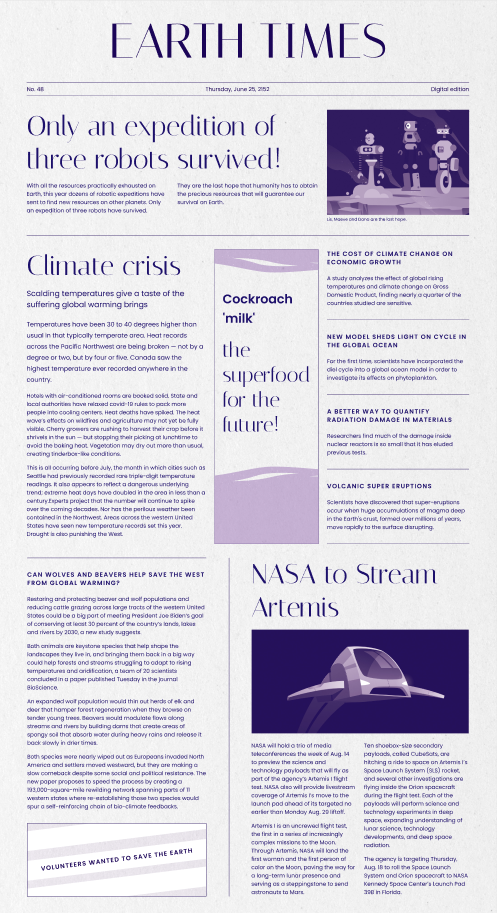

# Ejercicio final

**¡Felicidades! Has conseguido llegar al final del curso con vida.** Tenemos la seguridad que aprender a manejar las herramientas y conceptos que hemos tratado durante las clases te va a convertir en un gran maquetador. Por supuesto, el viaje no termina aquí. El dominio del lenguaje no es la única variable en la carrera de un buen profesional. Desde Classe te animamos a que sigas explorando otras vías y te recomendamos que le eches un vistazo [al resto de cursos que ofrecemos](https://classe.dev).

Bueno, sabemos que el curso ha sido duro y que algunos ejercicios han sido verdaderamente complicados. Si te ha gustado el desafío y te sientes con fuerzas, te queremos plantear un reto final. Vas a implementar tu propio periódico digital, el **EARTH TIMES**. Partiendo de este [Figma](https://www.figma.com/file/WU9SGCXr4wefVOdDoIJcrq/%5BClasse%5D-Ejercicios-pr%C3%A1cticos?node-id=551%3A4649&t=XmRaHrsoVmcIHQ0K-0) maqueta este diseño aplicando todos los conocimientos que has aprendido durante estas semanas!!!

Si durante el desarrollo tienes preguntas, no dudes en preguntar en el canal de Slack.

Y no olvides subir tu código a una PR del repositorio. [¿Recuerdas cómo entregar ejercicios en Classe?](https://github.com/Classe-Redradix/curso-contenidos-comunes/blob/main/entrega-de-ejercicios.md)