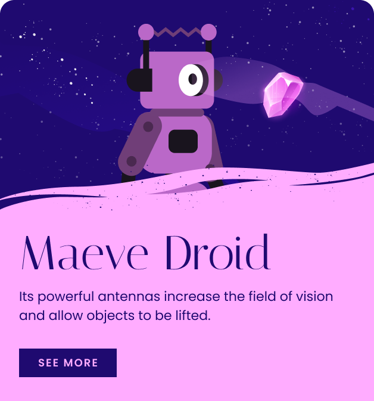

# Prework - Ejercicio

Si has llegado hasta aquí, ¡enhorabuena! Eso significa que estás un paso más cerca de empezar el curso.

Una vez repasado todo el contenido del prework, te proponemos hacer un ejercicio para poner todos estos conocimientos a prueba. ;)

Pero antes de ello queremos presentarte a Alter, una compañía de videojuegos (ficticia :P) que está preparando el lanzamiento de su última entrega al mercado: Last Hope, un videojuego en el que tendrás que explorar un planeta desconocido para obtener los preciados recursos que garanticen su supervivencia en la Tierra.

Están emocionados con el lanzamiento y quieren publicar antes una web para dar visibilidad al proyecto, por lo que te han pedido ayuda para este y otros elementos que irás descubriendo a lo largo del curso.

Tu primera misión será maquetar un componente que usarán para comenzar a promocionar a sus personajes:

Puedes ver el diseño en [esta página de Figma](https://www.figma.com/file/WU9SGCXr4wefVOdDoIJcrq/%5BClasse%5D-Ejercicios-pr%C3%A1cticos?node-id=674%3A354). Si no has usado nunca [Figma](https://www.figma.com/), no te preocupes, te dejamos [este vídeo](https://www.youtube.com/watch?v=hbN9RGcQFNU&ab_channel=DesignDuck) para que aprendas todo lo que necesitas saber en menos de cinco minutos, y a lo largo del curso lo explicaremos con más detalle.

Puedes hacer el ejercicio como quieras. No te preocupes por el resultado final, solo queremos que lo uses para calentar motores antes del arranque del curso.

Para entregarlo, puedes revisar nuestra [guía cómo entregar los ejercicios de Classe](https://github.com/Classe-Redradix/curso-contenidos-comunes/blob/main/entrega-de-ejercicios.md).

Recuerda que estamos disponibles para lo que necesites.
